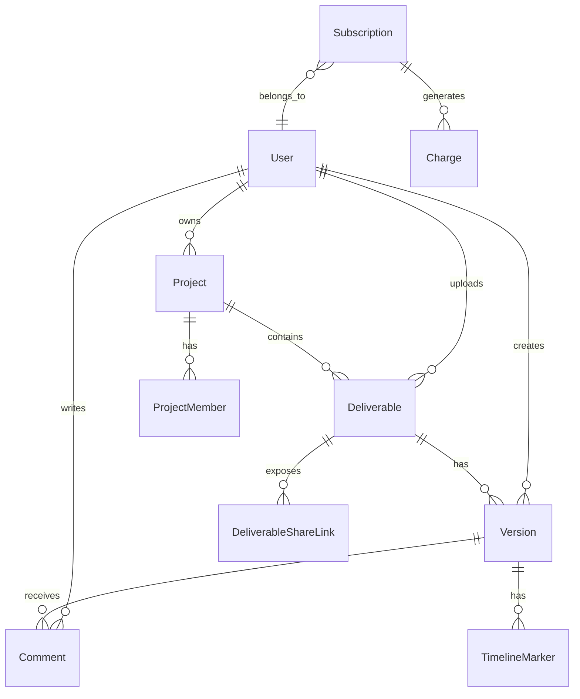

# Architecture — Modèle de données

Le schéma de référence est `prisma/schema.prisma`. Ce qui suit est un résumé
des entités principales et leurs relations.

## Entités clés

| Entité | Rôle |
|---|---|
| `User` | Compte utilisateur (créateur, client, talent) |
| `Project` | Conteneur de livrables — partagé par les `ProjectMember` |
| `Deliverable` | Vidéo livrable (titre, statut, deadline) |
| `Version` | Version d'un livrable. Contient `videoUrl`, `previewUrl`, `hlsUrl`, `status` |
| `Comment` | Commentaire timeline ou général sur une `Version` |
| `Subscription` | Abonnement Bictorys actif d'un user |
| `Charge` | Paiement individuel (lié à une subscription ou one-shot) |

!!! tip "Source de vérité"
    Pour la doc à jour : `npx prisma generate` puis lire les types dans
    `node_modules/.prisma/client/index.d.ts`. Ce diagramme est volontairement
    simplifié.
