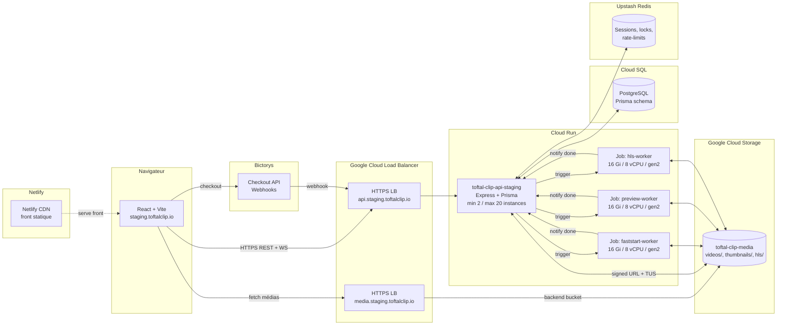

# Architecture — Vue d'ensemble

## Diagramme global

## Composants

| Composant | Rôle | Tech | Hébergement |
|---|---|---|---|
| Front-end | UI | React, Vite, TypeScript, Tailwind | Netlify (`staging.toftalclip.io`) |
| API | Endpoints REST + WebSocket | Express, Prisma, Socket.io | Cloud Run (`toftal-clip-api-staging`) |
| Base de données | Persistance | PostgreSQL 14 | Cloud SQL |
| Cache / sessions | Sessions, locks, rate-limits | Redis | Upstash |
| Stockage médias | Vidéos, thumbnails, HLS | GCS bucket `toftal-clip-media` | GCS + Cloud CDN |
| Worker faststart | Réécrit les MP4 avec moov atom au début | ffmpeg | Cloud Run Jobs |
| Worker preview | Génère un MP4 480p ultrafast | ffmpeg | Cloud Run Jobs |
| Worker HLS | Génère le master.m3u8 + segments multi-qualité | ffmpeg | Cloud Run Jobs |
| Paiements | Checkout + webhooks | Bictorys | Provider externe |

## Domaines

| Environnement | Front | API | Médias |
|---|---|---|---|
| Staging | `staging.toftalclip.io` | `api.staging.toftalclip.io` | `media.staging.toftalclip.io` (Cloud CDN) |
| Production | `toftalclip.io` | `api.toftalclip.io` | `media.toftalclip.io` |

## Choix d'archi notables

- **TUS via `@tus/gcs-store`** : les chunks d'upload sont écrits **directement
  sur GCS** au fur et à mesure. Cloud Run reste stateless, n'importe quelle
  instance peut servir n'importe quel chunk de n'importe quel upload — pas de
  sticky session nécessaire. Voir [Flows › Upload vidéo](../flows/video-upload.md).

- **Workers en Cloud Run Jobs gen2** : pour les vidéos de plusieurs Go (4K 1h+),
  `/tmp` étant RAM-backed, on a besoin de 16 Gi de RAM minimum. La gen2 donne
  aussi du SSD scratch pour les fichiers intermédiaires.

- **Cloud CDN sur backend bucket** : les vidéos sont servies via un Load Balancer
  HTTPS avec un backend bucket pointant sur GCS. Cache CDN edge → latence
  acceptable depuis l'Afrique de l'Ouest.

- **min-instances = 2** sur l'API : évite le cold-start sur le checkout-return
  (Bictorys redirige le user et on a 1-2 secondes pour répondre).
