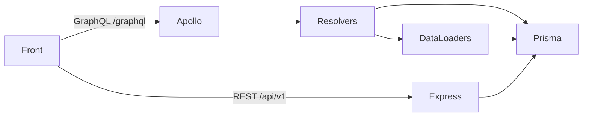

# Backend — GraphQL

L'API expose **deux interfaces** : REST (Express) pour les flows mutants
critiques (auth, upload, paiements, webhooks) et GraphQL (Apollo Server v4)
pour les lectures riches du front (listes, détails, joins).



## Stack

- `@apollo/server` v4 monté en route Express sur `/graphql`
- `@graphql-tools/schema` + `@graphql-tools/merge` pour assembler schemas
  et resolvers modulairement
- `graphql-scalars` pour DateTime, EmailAddress, JSON, etc.
- `dataloader` pour batcher les lookups N+1 (User, Deliverable)

## Layout

```
src/graphql/
├── index.ts                 # makeExecutableSchema + assembly
├── schemas/                 # SDL par domaine
│   ├── base.ts              # scalars communs, Query/Mutation roots vides
│   ├── auth.ts
│   ├── user.ts
│   ├── organization.ts
│   ├── project.ts
│   ├── deliverable.ts
│   ├── media.ts
│   ├── talent.ts            # mort, voir modules.md
│   ├── studio.ts
│   ├── opportunity.ts
│   └── admin.ts
├── resolvers/               # Resolvers correspondants
│   ├── scalars.ts
│   └── (un par schema)
├── dataloaders/
│   ├── index.ts             # createLoaders(prisma) → injecté dans le contexte
│   ├── user.loader.ts
│   └── deliverable.loader.ts
└── helpers/
    └── authz.ts             # checkProjectAccess, requireOwner, etc.
```

## Le contexte Apollo

Initialisé par requête, contient :

```typescript
{
  prisma: PrismaClient,
  loaders: ReturnType<typeof createLoaders>,
  user?: { id, email, role },        // null si requête non auth
  isAuthenticated: boolean,
}
```

Les resolvers consomment `ctx.loaders.user.load(id)` plutôt que
`prisma.user.findUnique({ where: { id } })` pour bénéficier du batching.

## DataLoaders en place

- `userLoader` — bat les lookups `User.findMany({ where: { id: { in: ids } } })`
- `deliverableLoader` — idem pour les livrables

À ajouter dès qu'un nouveau resolver fait apparaître un N+1 dans les logs
Cloud SQL (typiquement les listes de projets qui résolvent les membres).

## Auth

Le middleware GraphQL lit le header `Authorization: Bearer <token>` et,
s'il est valide, peuple `ctx.user`. Les resolvers qui exigent un user
authentifié appellent `requireAuth(ctx)` en début. Les resolvers qui
exigent une permission précise (ex. owner d'un projet) utilisent les
helpers de `helpers/authz.ts`.

## Conventions

- **Resolvers idempotents** : pas d'écriture en GraphQL Query (uniquement
  en Mutation). Les Query sont lectures pures.
- **Pagination** : cursor-based pour les listes potentiellement longues
  (commentaires, livrables). Page-based acceptable pour l'admin.
- **Pas de logique métier dans les resolvers** : ils orchestrent — la
  logique vit dans `src/services/` et est partagée avec les controllers REST.

## Endpoint

| URL | Usage |
|---|---|
| `POST /graphql` | Endpoint principal |
| `GET /graphql` (en dev) | Apollo Sandbox (introspection ON) |

En prod, l'introspection est désactivée et le sandbox 404.
