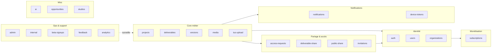

# Backend — Modules

L'API est organisée en **modules** dans `src/modules/`. Chaque module expose
ses propres routes et controllers et peut dépendre des services partagés
dans `src/services/` ou des resolvers GraphQL dans `src/graphql/`.

## Liste exhaustive

| Module | Rôle | Statut |
|---|---|---|
| `auth` | Login, register, refresh, logout, accept-invitation | Actif |
| `users` | Profil utilisateur, settings, recherche | Actif |
| `organizations` | Équipes / orgs, membres internes (= "team") | Actif |
| `admin` | Backoffice : impersonation, modération, audit, feature-flags | Actif |
| `projects` | CRUD projet, membres, transferts, settings | Actif |
| `deliverables` | CRUD livrables (vidéos d'un projet) | Actif |
| `versions` | Versions d'un livrable, commentaires, timeline markers | Actif |
| `media` | Upload images/audio/fichiers, signed URLs GCS | Actif |
| `tus-upload` | Endpoints TUS résumables (gros fichiers vidéo) | Actif |
| `internal` | Endpoints worker → API (`/version-ready`, `/preview-ready`, `/hls-ready`) | Actif |
| `invitations` | Email invitations vers projet ou équipe | Actif |
| `access-requests` | Demandes d'accès à un projet privé | Actif |
| `deliverable-share` | Liens publics pour une vidéo unique | Actif |
| `public-share` | Liens publics pour un projet entier | Actif |
| `subscriptions` | Plans, checkout Bictorys, webhooks | Actif |
| `notifications` | Persistance + push WebSocket des notifs in-app | Actif |
| `device-tokens` | Tokens FCM pour push notifications mobile | Actif |
| `beta-signups` | Inscriptions liste d'attente | Actif |
| `feedback` | Retours users (formulaire support) | Actif |
| `analytics` | Tracking events / agrégats produit | Actif |
| `ai` | Endpoints IA (transcription, suggestions Gemini/Groq) | Actif |
| `opportunities` | Annonces de missions (talents ↔ studios) | Actif |
| `studios` | Catalogue studios | Actif |
| `talents` | Catalogue freelances | **Mort — non utilisé** |
| `workflow` | Phases / tâches d'un livrable (vue Kanban) | **Mort — non utilisé** |

!!! warning "talents / workflow"
    Ces deux modules existent encore sur disque mais aucune feature active
    ne les appelle. Ne pas les documenter, ne pas s'appuyer dessus, ne pas
    les inclure dans les diagrammes. À supprimer dans une passe de nettoyage.

## Convention pour ajouter un module

1. Créer `src/modules/<nom>/` avec :
   - `routes.ts` — export d'un Express Router
   - `controllers/index.ts` — handlers
   - éventuellement `services/`, `validators/`, `types.ts`
2. Monter dans `src/app.ts` : `app.use('/api/v1/<nom>', router)`
3. Si exposition GraphQL voulue, créer le schema dans `src/graphql/schemas/`
   et le resolver dans `src/graphql/resolvers/`
4. Ajouter une ligne au tableau ci-dessus
