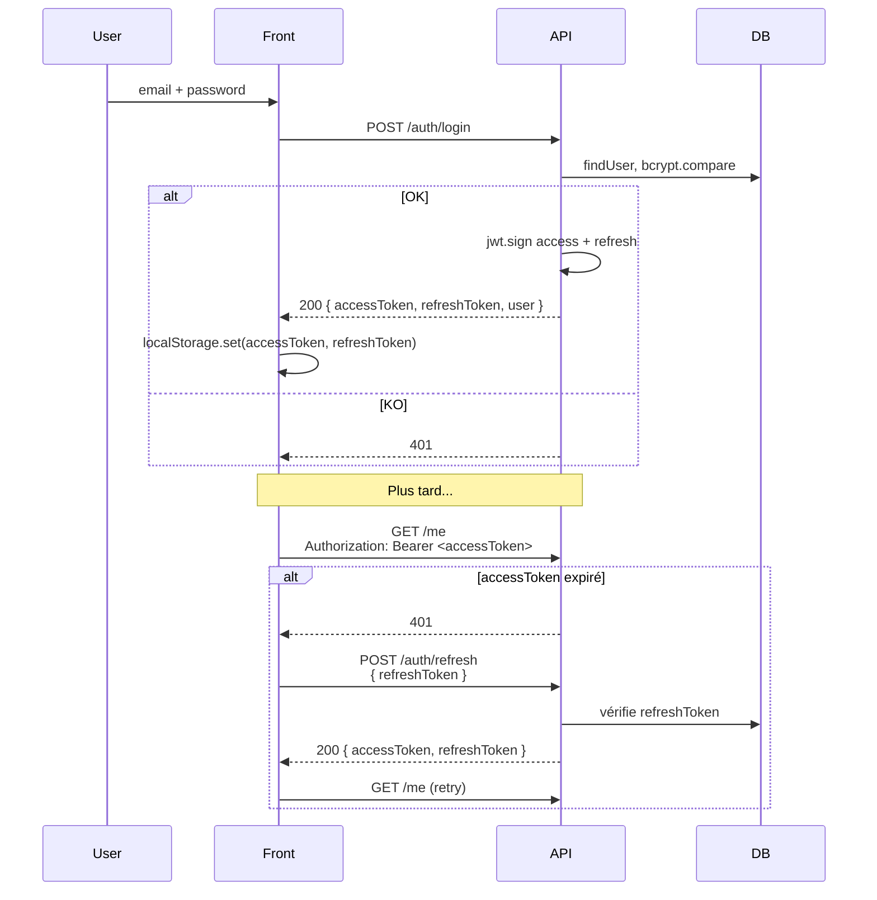
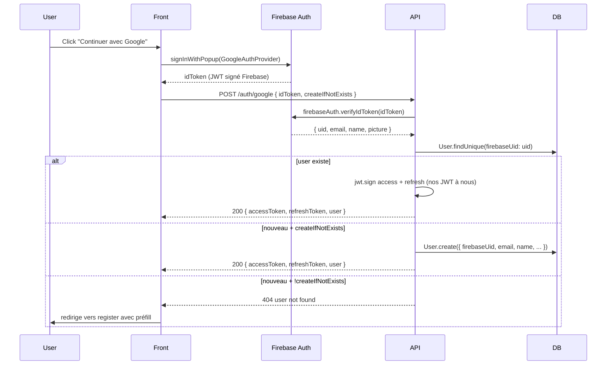

# Flows — Authentification

## Aperçu

Auth basée sur **JWT** : un access token courte durée + un refresh token plus
long. Endpoints clés :

- `POST /auth/register` — création de compte
- `POST /auth/login` — login
- `POST /auth/refresh` — rotation des tokens
- `POST /auth/logout` — invalidation côté serveur
- `POST /auth/accept-invitation/:token` — flux d'invitation



## Stratégie de stockage

- **Access token** : 15 min, en mémoire JS + `localStorage` pour survivre au refresh
- **Refresh token** : 30 jours, en `localStorage` aussi
- Pas de cookie httpOnly → simplicité, mais expose à un XSS. À changer si on
  accepte des contenus user-generated dans des champs HTML.

## Invitations

Les invitations envoient un email avec un token UUID v4. Le user clique →
front lit le token → POST `/auth/accept-invitation/:token` :

- si user **n'existe pas** : crée le compte + ajoute au projet/équipe
- si user **existe** : ajoute au projet/équipe directement

## Login Google (Firebase Auth)

Le login Google passe par **Firebase Authentication** côté front, puis
le backend vérifie le token Firebase via `firebase-admin`. Pas d'OAuth
manuel, pas de stockage des tokens Google côté API.



### Côté front

Le front utilise le SDK Firebase JS :

```typescript
import { getAuth, GoogleAuthProvider, signInWithPopup } from 'firebase/auth';

const provider = new GoogleAuthProvider();
const result = await signInWithPopup(getAuth(), provider);
const idToken = await result.user.getIdToken();
await api.post('/auth/google', { idToken, createIfNotExists: true });
```

### Côté API (`src/modules/auth/services/index.ts`)

```typescript
const decodedToken = await firebaseAuth.verifyIdToken(idToken);
const { uid, email, name, picture } = decodedToken;

let user = await prisma.user.findUnique({ where: { firebaseUid: uid } });
if (!user) {
  if (!createIfNotExists) throw new Error('User not found');
  user = await prisma.user.create({
    data: { firebaseUid: uid, email, name, avatarUrl: picture, ... }
  });
}
// → puis on signe nos propres access/refresh tokens et on les retourne
```

### Configuration Firebase (`src/config/firebase.ts`)

`firebase-admin` est initialisé avec un service account JSON, dans cet
ordre de priorité :

1. **Variable d'env `FIREBASE_SERVICE_ACCOUNT`** (JSON stringifié) — utilisée
   en Cloud Run
2. **Fichier `firebase-service-account.json`** à la racine du repo — utilisé
   en local (gitignored !)
3. **Project ID seul** (fallback dégradé — le verifyIdToken ne marchera pas)

!!! warning "firebase-service-account.json gitignored"
    Ce fichier contient une clé privée. Vérifier qu'il est bien dans
    `.gitignore` (et `.dockerignore`). Pour Cloud Run on passe via
    `FIREBASE_SERVICE_ACCOUNT` depuis Secret Manager.

### Pourquoi Firebase et pas un OAuth direct ?

- Le SDK front gère **toutes les complications OAuth** : popups, redirect,
  refresh des tokens Google, gestion multi-provider (on peut ajouter
  Apple/GitHub/etc. sans changer notre backend).
- `verifyIdToken` côté serveur fait la validation cryptographique (signature,
  audience, expiration) → sécurité au niveau d'Auth0 sans en payer le prix.
- Firebase Auth est **gratuit** jusqu'à 50k MAU.

### Liaison avec un compte email/password existant

Si un user a un compte email/password puis se connecte avec Google sur
le même email → on **link** : on remplit `firebaseUid` sur le `User`
existant. Il peut ensuite utiliser n'importe laquelle des deux méthodes.
Cette logique vit dans `loginWithGoogle` côté service auth.

## JWT sur Cloud Run multi-instance

Pourquoi le JWT marche **sans coordination** entre les instances Cloud
Run (qui peuvent être scalées de 2 à 20 instances en pleine charge) :

Le JWT est **self-contained**. Sa structure (header.payload.signature)
embarque tout ce dont l'API a besoin pour authentifier la requête :

```
eyJhbGc…       eyJpZCI6Im…       <hmac-sha256>
↑ header        ↑ payload         ↑ signature
  algo           userId            HMAC(payload, JWT_SECRET)
                 email
                 role
                 exp
```

Vérifier un JWT = recalculer `HMAC(payload, JWT_SECRET)` et le
comparer à la signature reçue. **Aucune DB query**, aucun cache, aucun
state partagé. N'importe quelle instance reçoit le token, peut le
vérifier, peut extraire l'identité du user — sans avoir jamais vu ce
user de sa vie. C'est la définition de "stateless".

Le `JWT_SECRET` est stocké dans Secret Manager (`JWT_SECRET:latest`) et
injecté dans chaque pod Cloud Run via `--set-secrets`. Toutes les
instances de tous les workers + le service API ont le **même** secret,
donc toutes peuvent vérifier les tokens émis par n'importe laquelle des
autres. Pas de "session sticky" requis.

### Comparaison avec les sessions classiques

| Critère | Session (cookie + Redis) | JWT |
|---|---|---|
| Storage | Server-side (Redis / DB) | Client-side (browser localStorage) |
| Validation | Lookup dans Redis (1-5 ms) | HMAC verify (~0.1 ms) |
| Multi-instance | Nécessite store partagé (Redis adapter) | Marche out-of-the-box |
| Révocation immédiate | Trivial (DELETE) | Difficile (besoin d'une blacklist) |
| Taille payload | Cookie ~50 bytes | JWT ~500-1500 bytes par requête |
| Renouvellement | Sliding window naturel | Nécessite endpoint /refresh |

Pour Toftal : on a choisi JWT pour le multi-instance natif. Le coût
"révocation difficile" est mitigé par l'access token court (15 min) :
même si un token est volé, il expire vite. Pour invalider une session
immédiatement (logout), le front supprime le token de son storage et
le serveur peut blacklister le refreshToken côté DB.

### Pourquoi le refresh token est en DB

Contrairement à l'access token (qu'on ne stocke jamais côté serveur),
le refresh token est inscrit dans la table `RefreshToken`. Raisons :

1. **Révocation**. Si un user clique "Logout from all devices", on
   DELETE toutes ses entrées RefreshToken → tous ses refresh future
   échouent → il se fait re-login.
2. **Rotation**. À chaque /refresh, on émet un nouveau refresh + le
   précédent est invalidé. Permet de détecter un refresh token volé
   (si l'attaquant en utilise un ancien après que le légitime a déjà
   tourné, on sait qu'il y a compromis).
3. **Anti-replay**. Sans ça, un refresh token volé permettrait de
   générer des access tokens infinis pour 30 jours.

L'access token reste 100% stateless. Le refresh est **stateful par
nécessité** mais hit la DB **uniquement** sur /refresh (= toutes les
15 min par user actif), pas sur chaque requête API.

## WebSocket multi-instance

Le JWT permet aussi à Socket.io de fonctionner cross-instance. Le
client fournit son `accessToken` dans le handshake → l'instance
réceptrice vérifie via HMAC (stateless) → établit la connexion. Quand
le service API émet à un user `socketService.emitToUser(userId, …)`,
le **Redis adapter** (`@socket.io/redis-adapter`) publie sur un canal
pub/sub, toutes les instances Socket.io abonnées le reçoivent, celle
qui a la connexion ouverte avec ce user fait suivre.

Voir `backend/services.md` pour les détails Socket.io.
