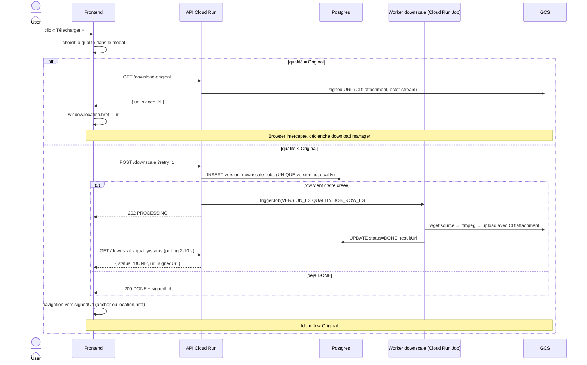

# Flow — Téléchargement vidéo (download)

Le download paraît anodin (« cliquer → recevoir un fichier ») mais sur
une vidéo de 1 GB + iOS Safari + un guest en partage public, on rencontre
TOUS les pièges d'un navigateur moderne. Cette page récapitule le flow
réel et les contournements appliqués.

## Vue d'ensemble



## Pourquoi un signed URL avec response-header overrides ?

Le fichier GCS sous-jacent est servi avec `Content-Type: video/mp4` et
sans Content-Disposition — c'est ce qu'il faut pour la **lecture** (le
`<video>` HTML5 s'attend à du `video/mp4`). Si on changeait ces headers
au niveau de l'objet stocké, on casserait la lecture.

Solution : générer une **signed URL v4** avec deux paramètres signés
qui surchargent la réponse à la volée :

```ts
file.getSignedUrl({
  version: 'v4',
  action: 'read',
  expires: Date.now() + 60 * 60 * 1000,
  responseDisposition: `attachment; filename="${suggestedFilename}"`,
  responseType: 'application/octet-stream',
});
```

GCS lit l'objet, applique les overrides à la réponse HTTP, le browser
voit `Content-Disposition: attachment; filename=…` + `Content-Type:
application/octet-stream` → déclenche son download manager au lieu de
streamer dans le `<video>`.

Côté code : `src/config/gcs.ts` → `getSignedDownloadUrl()`.

## Pourquoi `application/octet-stream` plutôt que `video/mp4` ?

iOS Safari a la fâcheuse manie d'**ignorer `Content-Disposition:
attachment`** sur les MIME médias (video/mp4, image/jpeg, audio/mp3).
Au lieu de sauver le fichier, il l'ouvre dans son player intégré
AVFoundation. Quand le profil H.264 / level n'est pas supporté →
écran noir muet → user pense que le download est cassé.

`application/octet-stream` retire toute ambiguïté : Safari sait que
c'est binaire pur, il ne tente pas de player, il déclenche le manager.

## Le piège iOS « transient activation »

Sur iOS Safari, `window.open()` / `target=_blank` ne fonctionnent que
**pendant la fenêtre d'activation d'un user gesture** (click / tap).
Tout `await` casse cette fenêtre. Donc le pattern naïf :

```ts
// ❌ Marche pas sur iOS post-await
async function onClick() {
  const url = await fetchSignedUrl();
  const a = document.createElement('a');
  a.href = url;
  a.target = '_blank';
  a.click();  // Safari bloque, silencieusement
}
```

Trois patterns selon la durée de l'async :

### Async court (~500 ms — Original quality)

`window.location.href = signedUrl` **dans le même tab**. La navigation
n'est pas un popup, donc pas soumise à la transient activation. Le
browser tente la navigation, voit `CD: attachment` dans la réponse,
**abandonne** la navigation et route le body vers le download manager.
La page reste exactement où elle était.

```ts
const { url } = await fetchSignedUrl();
window.location.href = url;  // Safari intercepte avant de naviguer
```

### Async long (30 s – 10 min — Downscale)

Impossible de garder l'utilisateur sur la page sans feedback pendant
10 min. Le widget de téléchargement passe par 4 états :

```
compressing → downloading → ready → completed
```

Sur iOS uniquement, on s'arrête en `ready` au lieu d'enchaîner
automatiquement. Le widget affiche un bouton « Toucher pour
télécharger » que l'utilisateur **tap explicitement** → c'est un
nouveau user gesture → `window.location.href` ou anchor click marche.

Source : `context/DownloadContext.tsx` → `triggerSavedDownload()`,
détection iOS via `navigator.userAgent`.

### Async très court (déjà cached / DONE)

Comportement identique à « Original quality » — `window.location.href`
immédiat, plus de widget à afficher.

## Dedup atomique des jobs downscale

Sans précaution, dix utilisateurs qui cliquent simultanément
« Télécharger 720p » sur la même vidéo lancent 10 workers Cloud Run
Jobs en parallèle qui font tous le même boulot. Coûte cher, pollue les
logs.

Solution : table dédiée avec contrainte d'unicité.

```sql
CREATE TABLE version_downscale_jobs (
  id TEXT PRIMARY KEY,
  version_id TEXT NOT NULL,
  quality TEXT NOT NULL,
  status DownscaleJobStatus NOT NULL DEFAULT 'PROCESSING',
  cloud_run_execution_id TEXT,
  result_url TEXT,
  error TEXT,
  started_at TIMESTAMP DEFAULT NOW(),
  finished_at TIMESTAMP,
  UNIQUE (version_id, quality)
);
```

Le service `enqueueDownscale()` fait un `INSERT … ON CONFLICT DO
NOTHING RETURNING id`. Le caller qui gagne la course voit `count === 1`
→ trigger le worker. Les autres voient `count === 0` → lisent la row
existante et reçoivent le même `jobId` à poller.

Source : `src/services/downscaleJobsService.ts`.

## Workers zombies + sweeper

Cloud Run peut SIGKILL un worker avant qu'il ait pu écrire le statut
terminal (OOM, reschedule, panne réseau). La row reste alors en
`PROCESSING` indéfiniment et bloque toute nouvelle tentative à cause de
la contrainte UNIQUE.

Solution : un **second Cloud Run Job** (`downscale-sweeper`) déclenché
toutes les 5 min par Cloud Scheduler. Il fait :

```sql
UPDATE version_downscale_jobs
SET status = 'FAILED', error = 'zombie recycled', finished_at = NOW()
WHERE status = 'PROCESSING'
  AND started_at < NOW() - INTERVAL '1 hour';
```

Une row vieille de plus d'une heure et toujours `PROCESSING` =
forcément zombie (le worker timeout est 1 h max). Une fois en
`FAILED`, le prochain click du user avec `?retry=1` (défaut côté
front) re-INSERT et re-trigger.

Source : `scripts/sweep-downscale-zombies.ts` + `cloudbuild*.yaml`
(deploy section `downscale-sweeper`).

## Optimisations ffmpeg

Avant : `-preset medium`, source streamée directement depuis HTTPS GCS,
4 vCPU. Une vidéo de 14 min mettait 50 min à encoder, on dépassait le
timeout Cloud Run.

Stack actuel (`src/services/VideoMetadataService.ts`) :

1. **Download local** : `wget --tries=3 --timeout=30 -O /tmp/source.mp4`
   → ffmpeg encode depuis le SSD local, plus de drop réseau mid-encode
2. **`-preset ultrafast` + `-tune fastdecode`** : 30 % plus rapide que
   veryfast
3. **`-c:a copy` quand l'audio source est AAC** (ffprobe avant) → on
   économise ~10 % de CPU
4. **`force_divisible_by=2`** : libx264 plante sur des dimensions
   impaires (sources portrait 9/16 scalées → 405 au lieu de 406)
5. **8 vCPU au lieu de 4** : libx264 scale linéairement jusqu'à 8 cores
6. **`-progress`** : on tail le fichier pendant l'encode pour voir où
   ça en est si une exec coince

Résultat : la même vidéo de 14 min passe à **~10 min** d'encode.

## HLS remux fast-path

Le HLS worker (`src/workers/hls.ts`) encode déjà la vidéo en 240p /
480p / 720p / 1080p au moment de l'upload pour le streaming adaptatif.
Quand un user demande une de ces qualités au download, ça serait
absurde de tout re-encoder.

Le worker downscale vérifie d'abord :

1. `version.alternativeQualities.master` existe (= HLS terminé) ?
2. La qualité demandée est dans la liste HLS (240p / 480p / 720p /
   1080p) ?

Si oui : `ffmpeg -i hls/<uuid>/<quality>/playlist.m3u8 -c copy
-bsf:a aac_adtstoasc -movflags +faststart output.mp4`. Pure remux,
aucun ré-encodage → **~30 s** au lieu de ~10 min.

Si non (2K / 4K, ou HLS pas encore terminé) : fallback sur l'encode
complet ci-dessus.

Source : `src/services/VideoMetadataService.ts` →
`remuxHlsVariantToMp4()`.

## Polling robustness

Le widget de téléchargement vit dans le `DownloadContext` mounted au
niveau App. Pourquoi pas dans la page deliverable ?

Mobile : un user tape « Back gesture » par accident → la page se
démonte → le polling `awaitDownscale()` qui vivait dans le composant
de page se kill avec elle → widget figé à 0 %, le worker continue
serveur-side mais le widget ne se met jamais à jour.

Solution : la pipeline complète (poll + fetch + anchor) vit dans une
**IIFE détachée** lancée par `startDownscaleAndDownload()`. Le state
React du widget est porté par le `DownloadContext` qui survit aux
unmount de pages. La nav arrière → widget reste, polling continue.

Source : `context/DownloadContext.tsx` →
`startDownscaleAndDownload()`.

## Backoff de polling

`services/downscaleClient.ts` → `awaitDownscale()` :
- Premier poll : 2 s après le 202
- Backoff exponentiel × 1.5 jusqu'à 10 s max
- Ceiling absolu : 30 min (re-réglable via `maxWaitMs`)

Couvre les vidéos longues sans hammering quand l'encode prend du
temps.

## Self-heal sur FAILED

`downscaleClient.postDownscale` envoie toujours `?retry=1`. Côté
backend, ça signifie : **si la row existante est FAILED, reset-la en
PROCESSING et re-trigger un nouveau worker**. Sur DONE / PROCESSING,
no-op (return la row existante).

L'utilisateur n'a jamais besoin de cliquer un bouton « Réessayer » :
chaque nouveau click sur Télécharger est implicitement un retry. Le
sweeper recycle les zombies, le retry consomme le FAILED → ça
s'auto-répare.

## Récap des bugs résolus

| # | Symptôme | Cause | Fix |
|---|---|---|---|
| 1 | Download synchronisé timeout sur longue vidéo | Cloud Run kille la requête > 60 min | Migration vers Cloud Run Job async + polling |
| 2 | Worker downscale FAIL silencieusement | Erreur ffmpeg avalée par le wrapper | Log la stderr ffmpeg + msg détaillé |
| 3 | Multiple workers pour la même `(version, quality)` | Pas de dedup | UNIQUE constraint + INSERT ON CONFLICT |
| 4 | Row PROCESSING bloquée pour toujours après crash worker | Pas de recovery | Cloud Scheduler `*/5 * * * *` → sweeper |
| 5 | iOS Safari : `Load failed` sur big files | OOM dans `new Blob(chunks)` sur 1 GB | `window.location.href` direct, pas de fetch JS |
| 6 | iOS Safari ouvre la vidéo au lieu de la télécharger | CD: attachment ignoré pour MIME médias | `Content-Type: application/octet-stream` |
| 7 | iOS Safari `a.click()` post-await silently ignored | Transient activation expirée | Bouton « Tap to save » dans le widget |
| 8 | Polling tué quand l'user navigate ailleurs | Logique dans page lifecycle | Déplacé dans `DownloadContext` App-level |
| 9 | Vieux fichiers cached sans `CD: attachment` toujours cassés sur iOS | Signed URL pas appliquée au cached path | `getDownscaleStatus()` re-signe à la volée |
| 10 | Encode 14 min vidéo > 50 min, timeout | medium preset + HTTPS stream + 4 vCPU | wget local + ultrafast + 8 vCPU + audio copy |
| 11 | Modal qualité lent à charger | Front re-lit le moov atom à chaque ouverture | Lecture de `Version.metadata` stocké au upload |
| 12 | Download Original OOM iOS | `fetch + new Blob(chunks)` sur 1 GB | Signed URL + `window.location.href` |
