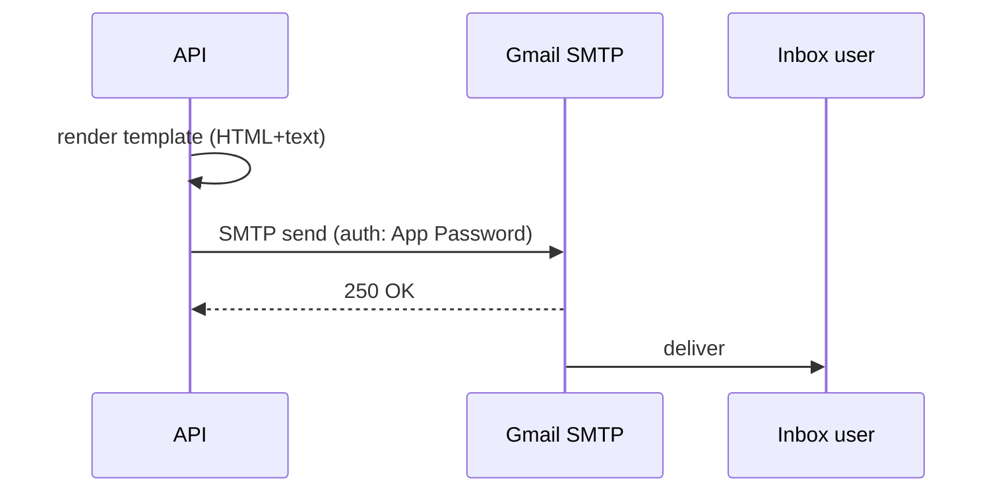

# Flows — Emails (Gmail SMTP)

Le provider d'envoi d'emails est **Gmail SMTP** via **Nodemailer**. C'est
un setup simple, gratuit, qui tient pour le volume actuel et qui peut
basculer sur un vrai SMTP transactionnel (SendGrid, Mailgun, Resend) sans
réécrire le code — juste en changeant les variables d'env.



## Configuration

`src/config/email.ts` choisit le transporter selon les variables d'env :

| Mode | Variables | Usage |
|---|---|---|
| **Gmail** | `EMAIL_SERVICE=gmail`, `EMAIL_USER`, `EMAIL_PASSWORD` | Production actuelle |
| **SMTP custom** | `SMTP_HOST`, `SMTP_PORT`, `SMTP_USER`, `SMTP_PASSWORD`, `SMTP_SECURE` | Si on bascule sur un autre provider |
| **Ethereal** (dev) | `ETHEREAL_USER`, `ETHEREAL_PASS` (ou rien) | Local — emails capturés sur ethereal.email |

### Gmail App Password (obligatoire)

Gmail n'accepte plus le mot de passe normal du compte depuis 2022. Il
faut un **App Password** dédié :

1. Activer la **double authentification** sur le compte Google qui sert
   d'expéditeur (compte type `noreply@toftalclip.io` via Workspace, ou
   `team.toftal@gmail.com` perso).
2. Aller sur https://myaccount.google.com/apppasswords
3. Créer un App Password "Toftal Clip API"
4. Stocker dans Secret Manager → `EMAIL_PASSWORD`

```bash
echo -n "abcd efgh ijkl mnop" | gcloud secrets versions add EMAIL_PASSWORD \
  --data-file=- --project=toftal-clip-api
```

(les espaces dans l'App Password sont optionnels — Gmail les ignore)

### Limites Gmail

- **500 emails/jour** par compte free Gmail
- **2000 emails/jour** par compte Workspace
- **100 destinataires max** par email

Au-dessus de ça, on doit basculer sur un SMTP transactionnel. Le code
gère déjà ce cas (`SMTP_HOST` prend la priorité si défini).

## Templates

`src/config/email.ts` expose des **wrappers HTML** réutilisables : un
header avec gradient pink/rose Toftal, le contenu au milieu, un footer
avec mentions légales et le lien d'unsubscribe.

Chaque type d'email a sa fonction dédiée qui retourne `{ subject, html, text }` :

| Fonction | Trigger | Destinataire |
|---|---|---|
| `getInvitationEmail` | Invitation à un projet | Personne invitée |
| `getProjectShareEmail` | Lien de partage projet créé | Destinataire du lien |
| `getDeliverableShareEmail` | Lien de partage vidéo créé | Destinataire du lien |
| `getOwnershipTransferEmail` | Demande de transfert | Futur owner |
| `getOwnershipTransferAcceptedEmail` | Transfert accepté | Ancien owner |
| `getAccessRequestEmail` | Quelqu'un demande accès au projet | Owner du projet |
| `getAccessRequestApprovedEmail` | Demande approuvée | Demandeur |
| `getPaymentSuccessEmail` | Paiement Bictorys validé | Subscriber |
| `getPaymentFailedEmail` | Paiement échoué | Subscriber |
| ... | ... | ... |

Tous les templates sont **versionnés en code** pour l'instant. Une
itération possible : passer en table `EmailTemplate` (comme les prompts
IA), pour qu'une PM puisse modifier le wording sans deploy. Le seeder
`npm run seed:email-templates` est prévu pour ça mais n'est pas encore
branché aux fonctions ci-dessus.

## Envoi

Convention : passer par `EmailService.send(...)` (cf.
[Services](../backend/services.md)) plutôt que d'appeler `transporter`
directement. Ça centralise le retry, le logging et le tracking.

```typescript
import { EmailService } from '../../services/EmailService';
import { getInvitationEmail } from '../../config/email';

const { subject, html, text } = getInvitationEmail({
  inviterName: req.user.name,
  projectName: project.name,
  acceptUrl: `https://staging.toftalclip.io/accept-invitation/${token}`,
});

await EmailService.send({
  to: invitee.email,
  subject,
  html,
  text,
});
```

## Suivi des envois

`auditLogger` enregistre chaque tentative d'envoi avec :

- destinataire
- type d'email
- statut (`SENT`, `FAILED`)
- erreur SMTP éventuelle

Filter dans Cloud Logging :

```bash
gcloud logging read \
  'resource.type="cloud_run_revision"
   AND resource.labels.service_name="toftal-clip-api-staging"
   AND textPayload:"[email]"' \
  --limit=30 --freshness=1h --project=toftal-clip-api
```

## Pièges

!!! warning "Spam folder"
    Gmail-to-Gmail passe en général. Gmail-vers-autre-provider (Outlook,
    Yahoo, FAI domaines moins fréquentés) finit régulièrement en
    **spam** parce que :
    
    - Pas de SPF/DKIM correctement configuré sur `toftalclip.io`
    - L'expéditeur est un Gmail générique pas une adresse `@toftalclip.io`
    
    Solution propre : config Workspace + DNS (SPF, DKIM, DMARC) sur
    `toftalclip.io` puis basculer `EMAIL_USER=noreply@toftalclip.io`.

!!! warning "App Password révoqué"
    Si Google détecte une activité suspecte sur le compte source, il
    révoque les App Passwords et les emails partent en silence (auth
    failure dans les logs). À surveiller dans Cloud Logging :
    `[email] FAILED 535-5.7.8 Username and Password not accepted`.

!!! warning "Volume = upgrade obligatoire"
    Au-delà de ~1000 emails/jour de production, basculer sur un vrai
    SMTP transactionnel. Pour migrer :
    
    1. Provisionner un compte (Resend recommandé pour le free tier
       généreux : 3000/mois, 100/jour)
    2. Set `SMTP_HOST=smtp.resend.com`, `SMTP_PORT=465`, `SMTP_SECURE=true`,
       `SMTP_USER=resend`, `SMTP_PASSWORD=<API_KEY>`
    3. Le code détecte `SMTP_HOST` et bascule automatiquement.

## Variables d'env

| Variable | Usage |
|---|---|
| `EMAIL_SERVICE` | `gmail` pour activer le mode Gmail |
| `EMAIL_USER` | Adresse Gmail expéditrice (ex. `team.toftal@gmail.com`) |
| `EMAIL_PASSWORD` | App Password Gmail (Secret Manager) |
| `EMAIL_FROM_NAME` | Nom affiché (ex. "Toftal Clip") |
| `SMTP_HOST` | Override : pour bascule sur SMTP custom |
| `SMTP_PORT` | 587 (TLS) ou 465 (SSL) |
| `SMTP_SECURE` | `true` pour SSL (port 465) |
| `SMTP_USER`, `SMTP_PASSWORD` | Credentials SMTP custom |
| `ETHEREAL_USER`, `ETHEREAL_PASS` | Dev local fallback |
