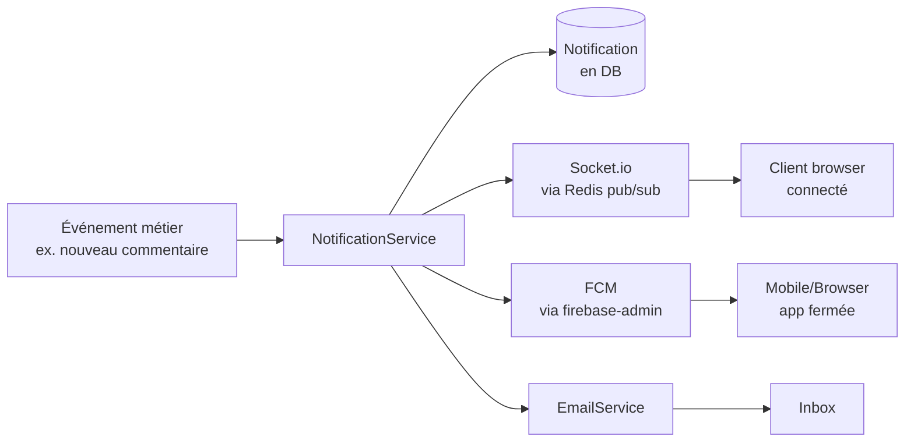

# Flows — Notifications

Trois canaux de notifications sont en place :

| Canal | Tech | Usage |
|---|---|---|
| **In-app** | Socket.io + Redis adapter | Toast / badge / notification panel temps réel quand le user est sur l'app |
| **Push mobile / web** | Firebase Cloud Messaging (FCM) | Notification système même si l'app est fermée |
| **Email** | SMTP transactionnel | Notifications importantes (invitation, transfert ownership, paiement) |

## Vue d'ensemble



## Push notifications (FCM)

### Côté front

L'app demande la permission notifications, récupère un **device token**
via Firebase Messaging et l'envoie au backend :

```typescript
import { getMessaging, getToken } from 'firebase/messaging';

const messaging = getMessaging();
const token = await getToken(messaging, { vapidKey: VITE_FCM_VAPID_KEY });
await api.post('/device-tokens', { token, platform: 'web' });
```

Le `vapidKey` est la **public Web Push key** de Firebase Console →
Project settings → Cloud Messaging → Web Push certificates. Elle est
publique, on peut la mettre dans le bundle front.

### Côté API (module `device-tokens`)

L'API stocke les tokens dans la table `DeviceToken` avec :

| Colonne | Usage |
|---|---|
| `token` | Le token FCM lui-même |
| `userId` | À qui il appartient |
| `platform` | `web`, `ios`, `android` |
| `lastUsedAt` | Pour purger les anciens |

Endpoints :

- `POST /device-tokens` — enregistrer un token
- `DELETE /device-tokens/:token` — désenregistrer (logout)

### Envoi d'une push (`pushNotificationService`)

```typescript
import { pushNotificationService } from '../../services/pushNotificationService';

await pushNotificationService.sendToUser(userId, {
  title: 'Nouvelle version',
  body: '<author> a uploadé V3 sur <deliverable>',
  data: { deliverableId, versionId },
  click_action: '/deliverable/<id>',
});
```

Le service :

1. Lit tous les `DeviceToken` actifs du user
2. Construit le payload FCM (champ `notification` + `data`)
3. Appelle `firebase-admin` `messaging().sendEachForMulticast(...)`
4. Pour chaque token qui retourne `messaging/registration-token-not-registered`,
   delete-le de la base (purge auto)

### Payload FCM

FCM différencie deux blocs dans le payload :

- `notification` — titre/body affichés par l'OS automatiquement
- `data` — clés-valeurs custom, accessibles par le service worker (web)
  ou la callback de l'app native

On envoie **les deux** : `notification` pour que ça s'affiche même si
l'app n'écoute pas, et `data` pour permettre le routing au tap.

### Service worker (web)

Le front a un `firebase-messaging-sw.js` qui écoute les push reçues
quand l'onglet est en arrière-plan ou fermé. Il affiche la notif système
et, au tap, redirige vers `data.click_action`.

### Purge auto des tokens morts

Quand FCM répond `messaging/registration-token-not-registered` (l'user a
désinstallé l'app, désactivé les notifs, ou le SW a été révoqué), le
`pushNotificationService` supprime le token de la base **dans le même
appel**. Pas besoin de cron de cleanup — la table `DeviceToken` reste
cohérente naturellement.

```typescript
const response = await firebaseAdmin.messaging().sendEachForMulticast(message);
response.responses.forEach((resp, idx) => {
  if (resp.error?.code === 'messaging/registration-token-not-registered') {
    prisma.deviceToken.delete({ where: { token: tokenList[idx] } });
  }
});
```

### Pièges connus

!!! warning "VAPID key public mais sensible"
    La `VITE_FCM_VAPID_KEY` côté front est publique (par design — c'est
    une clé publique au sens cryptographique). Mais elle identifie le
    project Firebase, donc si on la change, **tous les tokens existants
    deviennent invalides**. Ne pas la rotater sans plan.

!!! warning "Service worker en cache"
    Le browser cache `firebase-messaging-sw.js` agressivement. Quand on
    change le SW, ajouter un `?v=N` à l'URL d'enregistrement ou attendre
    24 h pour le refresh naturel. Sinon les users continuent à
    fonctionner avec l'ancien SW.

!!! warning "iOS Safari < 16.4"
    Pas de Web Push avant iOS 16.4, et même après il faut que la PWA
    soit **installée** (Add to Home Screen). Sur iPhone non-PWA :
    fallback sur les emails ou les notifs in-app.

### Plateformes

| Plateforme | Statut |
|---|---|
| Web (Chrome, Edge, Firefox) | OK via service worker + VAPID |
| iOS (Safari) | OK depuis iOS 16.4 (PWA installée seulement) |
| Android (Chrome, app PWA) | OK |
| App native iOS | Pas en place (besoin d'APNs) |
| App native Android | Pas en place |

## In-app (Socket.io)

À chaque insert dans la table `Notification`, l'API émet un event
Socket.io vers la room `user:<userId>`. Le front écoute et update le
panel + badge.

```typescript
socket.on('notification:new', (notif) => {
  setNotifications(prev => [notif, ...prev]);
  showToast(notif);
});
```

Multi-instance OK grâce au Redis adapter
(`@socket.io/redis-adapter`) — voir [Services](../backend/services.md#socketio--redis-adapter).

## Email

Pour les notifs **persistantes** (un email reste dans l'inbox), on
appelle `EmailService.send(template, vars, to)` en plus du in-app.

Cas d'usage :

- Invitation à un projet
- Acceptation/refus d'un transfert de propriété
- Paiement réussi / échoué
- Demande d'accès à un projet (côté owner)

## Préférences user

Pas en place pour l'instant — chaque user reçoit toutes les notifs
configurées par défaut. À ajouter : table `NotificationPreferences` avec
opt-in/opt-out par canal et par catégorie.

## Variables d'env

| Variable | Usage |
|---|---|
| `FIREBASE_SERVICE_ACCOUNT` | JSON du SA Firebase (Cloud Run) |
| `FIREBASE_PROJECT_ID` | Fallback si pas de SA |
| `VITE_FCM_VAPID_KEY` (front) | Clé publique Web Push |
