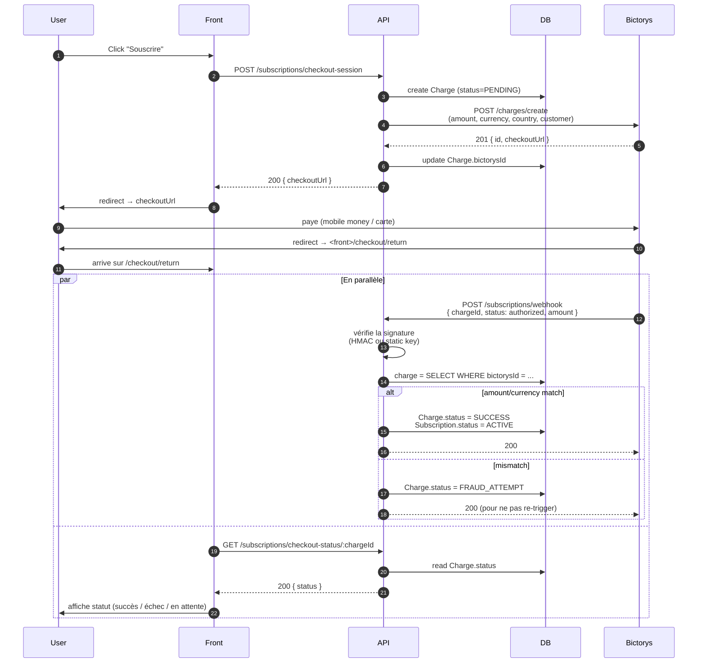

# Flows — Paiements (Bictorys)

## Vue d'ensemble

Bictorys est notre passerelle de paiement (mobile money + cartes pour
l'Afrique de l'Ouest). On l'utilise pour :

- **Création d'un checkout** : on demande à Bictorys une URL où l'user paye
- **Webhook** : Bictorys notifie l'API quand un paiement est validé/refusé
- **Anti-fraude** : on cross-check le montant + la devise du webhook contre
  notre Charge en base avant de marquer la subscription active

## Diagramme de séquence

## Pièges connus

!!! warning "Pas d'endpoint `GET /charges/:id` côté Bictorys"
    L'ancienne implémentation faisait du polling fallback sur cet endpoint,
    mais il n'existe pas en sandbox (et probablement pas en prod non plus).
    On a tout retiré — le statut vient **uniquement du webhook**.

!!! warning "WAF Bictorys"
    L'ancienne implémentation contournait un blocage WAF sur les requêtes
    "in-flight" via une création async + retry. Ce contournement n'est plus
    nécessaire, l'appel à `/charges/create` est synchrone.

!!! warning "Plusieurs webhooks configurés"
    Bictorys permet de configurer **plusieurs URLs de webhook** par compte.
    Si tu vois des webhooks ne pas arriver en sandbox, vérifie l'admin
    Bictorys que **seule** l'URL staging est active.

!!! tip "Test webhook"
    Pour valider la chaîne en local, utiliser webhook.site → exposer un tunnel
    ngrok vers l'API locale → reconfigurer temporairement l'URL Bictorys.

## Anti-fraude

Avant de marquer une `Charge` comme `SUCCESS`, on vérifie sur le webhook :

1. **Signature** valide (HMAC-SHA256 si secret configuré, sinon static key)
2. **chargeId** existe en base et est encore `PENDING`
3. **amount** du webhook == amount stocké en base
4. **currency** match
5. **status** ∈ `{ authorized, paid, captured }` → success
   sinon ∈ `{ reversed, refunded, failed }` → failure

Si une vérif échoue, on log un warning explicite (`AMOUNT MISMATCH`,
`CURRENCY MISMATCH`, `SIGNATURE INVALID`, etc.) pour pouvoir suivre dans
Cloud Logging.

## Variables d'environnement

| Variable | Usage |
|---|---|
| `BICTORYS_PUBLIC_KEY` | Identifiant marchand (header `X-Public-Key`) |
| `BICTORYS_SECRET_KEY` | Auth pour les appels API (header `Authorization`) |
| `BICTORYS_WEBHOOK_SECRET` | Vérification signature webhook |
| `BICTORYS_BASE_URL` | Endpoint Bictorys (sandbox / prod) |
