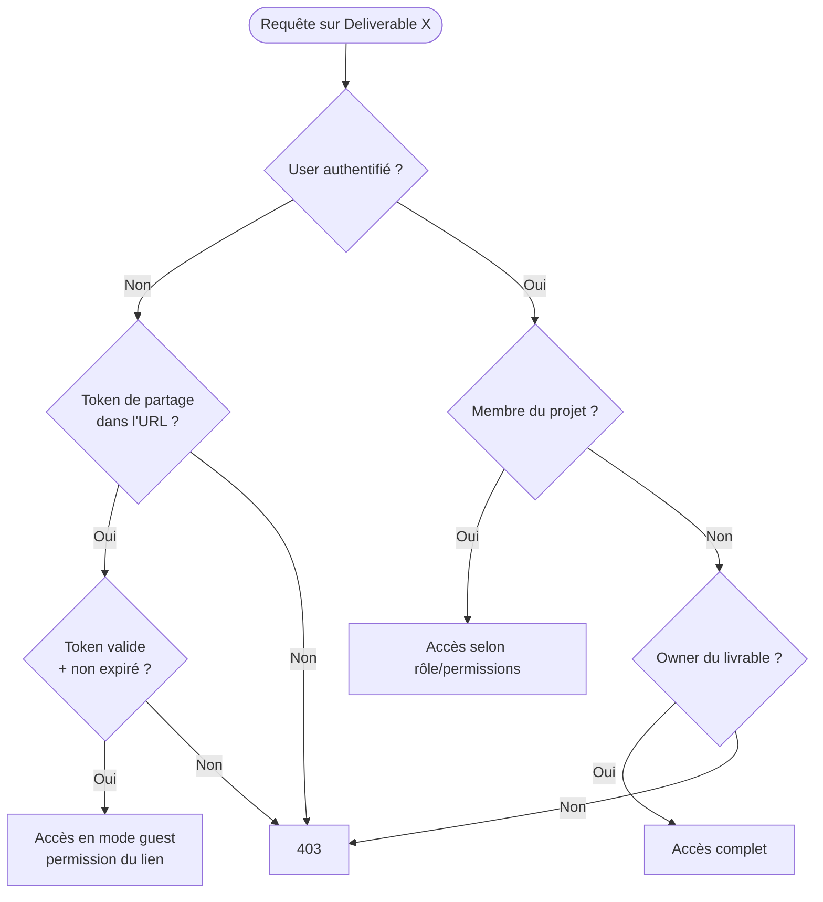

# Flows — Partage de projets et de vidéos

## Trois mécanismes de partage

1. **Membres directs** : on ajoute un user à un projet avec un rôle
   (`OWNER`, `COLLABORATOR`, `VIEWER`) et des permissions
   (`view`, `comment`, `download`).
2. **Lien public** : on crée un `PublicShareLink` (projet) ou
   `DeliverableShareLink` (vidéo unique) avec un token signé. Quiconque a
   le lien accède selon la permission du lien.
3. **Invitation par email** : envoie un email contenant un lien d'acceptation
   d'invitation.

## Visibilité d'un livrable

## Permissions

| Niveau | view | comment | download | Représentation UI |
|---|---|---|---|---|
| `view` | ✓ | ✗ | ✗ | "Lecteur" |
| `comment` | ✓ | ✓ | ✗ | "Commentateur" |
| `download` | ✓ | ✓ | ✓ | "Éditeur" |

Le rôle `OWNER` a toujours toutes les permissions et peut transférer la
propriété (avec confirmation par email du destinataire).
