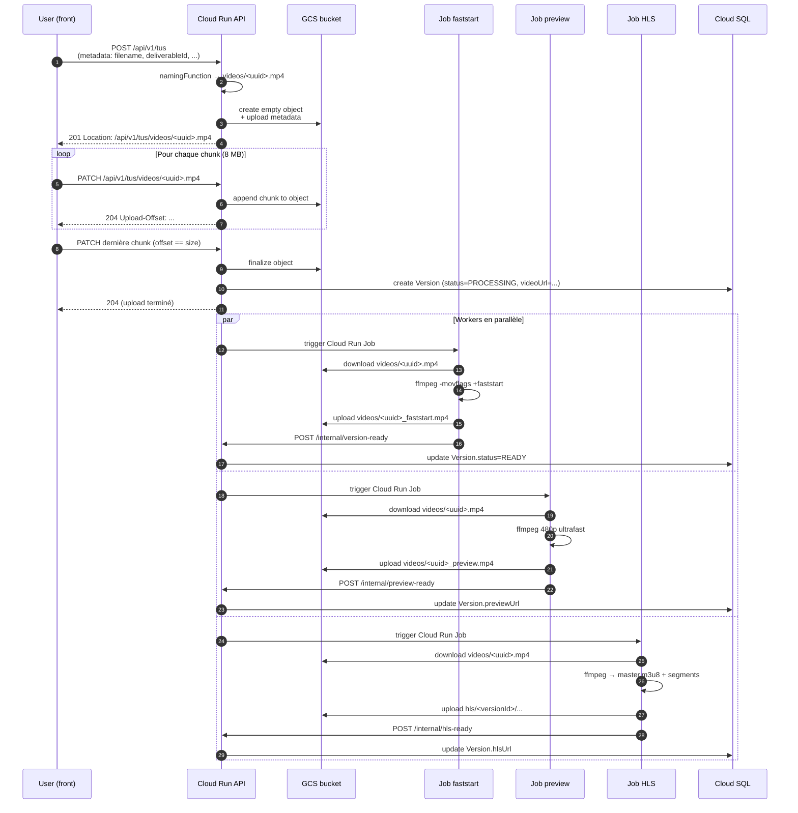

# Flows — Upload vidéo

## Vue d'ensemble

L'upload d'une vidéo de livrable utilise **TUS** (resumable) au-dessus de
`@tus/gcs-store`. Les chunks vont **directement sur GCS** au fur et à mesure,
sans étape de transfert intermédiaire. Trois workers sont ensuite déclenchés
en parallèle pour préparer la vidéo à la lecture.

## Diagramme de séquence

## Détails

### Côté front (`services/mediaService.ts`)

- Seuil TUS : **100 MB**. En dessous, signed URL multipart vers GCS.
- Chunks de **8 MB** (optimal pour les multipart writes GCS).
- `findPreviousUploads()` côté `tus-js-client` permet de reprendre une session
  interrompue. Le fingerprint est en localStorage (`tus:<hash>`).
- En cas de **failure de resume** (HEAD 404 sur l'upload id), le client wipe
  le fingerprint et tente un nouvel upload une fois.

### Côté API (`src/config/tus.ts`)

- `namingFunction` : retourne `videos/<uuid>.<ext>`. Le path GCS est figé dès
  la création — l'`id` TUS **est** le path GCS.
- `getFileIdFromRequest` : custom parser qui extrait le pathname du
  fetch-API Request et garde le slash (sinon le défaut `/([^/]+)\/?$/` ne
  capture que `<uuid>.<ext>` et le lookup GCS échoue).
- `respectForwardedHeaders: true` : indispensable derrière Cloud Run / GCLB,
  sinon la `Location` retournée au client est en `http://` et le browser
  bloque pour mixed content.
- `MemoryLocker` : verrou per-instance OK car GCSStore + une seule write par
  upload à la fois côté tus-js-client (chunks séquentiels).

### Workers (Cloud Run Jobs)

| Worker | Image | Sizing | Output |
|---|---|---|---|
| faststart | même image que l'API, override CMD | 16 Gi / 8 vCPU / gen2 / 30 min | `<id>_faststart.mp4` |
| preview | idem | 16 Gi / 8 vCPU / gen2 / 15 min | `<id>_preview.mp4` (480p) |
| hls | idem | 16 Gi / 8 vCPU / gen2 / 30 min | `hls/<versionId>/master.m3u8` |

!!! warning "Pourquoi 16 Gi et pas 8 ?"
    Cloud Run gen2 stocke `/tmp` en **RAM**, pas sur disque. Sur une vidéo 4K
    d'1h, le fichier source + l'output dépassent facilement 8 Gi → OOM kill.
    Sizing minimum sûr : 16 Gi.

!!! warning "Prisma idle timeout"
    Sur les vidéos très longues, le download GCS prend plusieurs minutes —
    Cloud SQL coupe la connexion idle pendant ce temps. Les workers font
    `await prisma.$disconnect()` **avant** le download et créent une nouvelle
    connexion après l'encode pour notifier l'API.

## Pourquoi GCSStore plutôt que FileStore ?

L'ancienne implémentation utilisait `@tus/file-store` : les chunks étaient
écrits sur le disque local de l'instance Cloud Run, puis transférés
asynchrone vers GCS à la fin. Problèmes :

- **Pas multi-instance** : si la POST atterrit sur l'instance A et la PATCH
  sur l'instance B, B n'a pas le fichier sur son disque → 404.
- **Sticky sessions inefficaces** : le cookie GCLB est sur le domaine
  `.run.app`, il ne traverse pas vers `api.staging.toftalclip.io`.
- **`/tmp` éphémère** : Cloud Run peut redémarrer une instance n'importe
  quand, le fichier en cours d'upload disparaît.
- **Étape de transfert async** : ajoutait une UI de "Finalisation… X%" après
  le 100% qui prêtait à confusion.

GCSStore résout les quatre d'un coup : les bytes sont sur GCS dès la première
chunk, n'importe quelle instance Cloud Run peut servir la suite, et l'upload
est "fini" au sens utilisateur dès le dernier PATCH.
