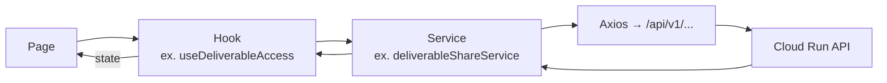

# Frontend — Gestion du state

Pas de Redux ni Zustand. **React Context** pour le state global,
**useState** pour le state local.

## Contextes globaux

| Context | Fichier | Contenu |
|---|---|---|
| `AuthContext` | `context/AuthContext.tsx` | user courant, accessToken, login/logout |
| `OrgContext` | `context/OrgContext.tsx` | équipes/orgs du user |
| `UploadContext` | `context/UploadContext.tsx` | uploads actifs (TUS et autres) |
| `ToastContext` | `context/ToastContext.tsx` | toasts globaux |

## Flow type



## Hooks de feature

Pattern : un hook `use<Feature>` encapsule la logique réseau + state d'une
feature (`useProjectAccess`, `useDeliverableAccess`, `useToast`, etc.).

```typescript
export const useProjectAccess = (projectId?: string) => {
  const [data, setData] = useState(...);
  const [loading, setLoading] = useState(false);
  // fetchers
  return { ...data, loading, refresh, ... };
};
```

Les hooks gèrent eux-mêmes le revalidate via `useEffect` sur le `projectId`.

## Real-time (Socket.io)

Connexion ouverte une fois dans un context dédié, puis chaque hook qui veut
écouter un event s'abonne via un `useEffect`.

```typescript
useEffect(() => {
  const handler = (payload: VersionReady) => {
    refresh();
  };
  socket.on('version:ready', handler);
  return () => socket.off('version:ready', handler);
}, [refresh]);
```

## Persistence locale

- `localStorage` : `accessToken`, `refreshToken`, fingerprints TUS, settings UI
- Pas de IndexedDB pour l'instant
- Pas de service worker / PWA
