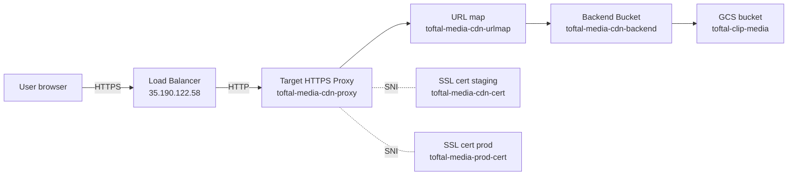

# Infra — CDN média (`media.toftalclip.io`)

Toutes les vidéos / thumbnails / audios sont servis via un **Cloud
CDN** posé devant le bucket GCS `toftal-clip-media`. Sans CDN, chaque
playback hammer GCS depuis chaque user end-device, latence ~200-500 ms
sur la 1ère requête, pas de mise en cache near-edge. Avec CDN, la
plupart des requêtes sont servies depuis le Point-of-Presence Google
le plus proche du user (~20-50 ms).

## Schéma



## Resources GCP

| Resource | Nom |
|---|---|
| Global forwarding rule | `toftal-media-cdn-forward` |
| Anycast IPv4 | `35.190.122.58` |
| Target HTTPS proxy | `toftal-media-cdn-proxy` |
| URL map | `toftal-media-cdn-urlmap` |
| Backend bucket | `toftal-media-cdn-backend` |
| GCS bucket | `toftal-clip-media` |
| SSL cert staging | `toftal-media-cdn-cert` (couvre `media.staging.toftalclip.io`) |
| SSL cert prod | `toftal-media-prod-cert` (couvre `media.toftalclip.io`) |

Le proxy a les **deux** certs attachés simultanément. SNI route la
bonne réponse selon le `Host` header de la requête entrante. Un seul
load balancer pour les 2 environnements = coût divisé par 2.

## Domaines

| Env | Domaine | DNS record |
|---|---|---|
| staging | `media.staging.toftalclip.io` | A → `35.190.122.58` |
| prod | `media.toftalclip.io` | A → `35.190.122.58` |

Configuré chez le registrar du domaine `toftalclip.io`.

## Cycle de vie d'une requête

1. Browser résout `media.toftalclip.io` → `35.190.122.58`
2. TCP/TLS handshake avec le LB (cert présenté = celui qui matche le
   SNI hostname)
3. Le LB forwarde au target proxy
4. Le URL map route la requête (`defaultService: backendBucket`)
5. Cloud CDN check : le path est-il dans le cache de l'edge ?
   - **Hit** : sert depuis le cache, ne touche pas GCS
   - **Miss** : fetch depuis GCS, met en cache pour la prochaine fois
6. Réponse au browser

## Pourquoi un seul URL map (catch-all)

```yaml
defaultService: backendBucket  # toftal-media-cdn-backend
# pas de hostRules / pathMatchers
```

Toutes les requêtes (que `Host` soit staging ou prod) vont au même
backend bucket = même GCS. Les vidéos staging et prod cohabitent dans
le même bucket. Distingués par l'ID UUID dans le path (`videos/<uuid>.mp4`)
qui est généré côté API et stocké en DB de chaque env.

Pour séparer staging/prod en buckets distincts plus tard :
1. Créer un 2e backend bucket
2. Ajouter un `hostRule` dans le URL map :
   ```yaml
   hostRules:
     - hosts: [media.staging.toftalclip.io]
       pathMatcher: staging-matcher
     - hosts: [media.toftalclip.io]
       pathMatcher: prod-matcher
   ```
3. Migrer les fichiers existants

## Ajouter un nouveau domaine

Exemple : `media.preview.toftalclip.io` pour un environnement de PR
preview.

```bash
# 1. Créer un cert managé pour le nouveau domaine
gcloud compute ssl-certificates create toftal-media-preview-cert \
  --domains=media.preview.toftalclip.io \
  --global

# 2. L'attacher au proxy existant (avec les autres)
gcloud compute target-https-proxies update toftal-media-cdn-proxy \
  --ssl-certificates=toftal-media-cdn-cert,toftal-media-prod-cert,toftal-media-preview-cert \
  --global-ssl-certificates

# 3. Ajouter le record DNS A → 35.190.122.58
#    (chez le registrar)

# 4. Attendre que Google valide le cert (5-30 min)
gcloud compute ssl-certificates describe toftal-media-preview-cert \
  --format='value(managed.status,managed.domainStatus)'
# → ACTIVE / media.preview.toftalclip.io=ACTIVE
```

Une fois actif, `https://media.preview.toftalclip.io/videos/<uuid>.mp4`
marche.

## Troubleshooting

### Cert bloqué en `PROVISIONING`

Google valide la propriété en checkant que le domaine résout vers
l'IP du LB **avant** d'émettre le cert. Si le cert reste en
`PROVISIONING` plus de 30 min :

```bash
gcloud compute ssl-certificates describe toftal-media-prod-cert
```

Regarde le champ `managed.domainStatus.<domain>`. Si c'est
`FAILED_NOT_VISIBLE`, le DNS ne pointe pas (encore) vers l'IP. Check
avec `nslookup <domain> 8.8.8.8` depuis plusieurs résolveurs DNS.

### Vidéo qui charge mais headers bizarres

Le CDN cache les réponses GCS **avec leurs headers à l'instant T**.
Si on a uploadé une vidéo avant que `Content-Disposition: attachment`
ne soit configuré côté GCS, la version cached n'a pas le header.

Invalidation :

```bash
gcloud compute url-maps invalidate-cdn-cache toftal-media-cdn-urlmap \
  --path="/videos/<uuid>.mp4"
```

(L'invalidation se propage à tous les edges en ~1-2 min.)

### `ERR_NAME_NOT_RESOLVED` dans le browser

DNS pas (encore) propagé OU jamais configuré. Check via :

```bash
nslookup media.toftalclip.io 8.8.8.8  # Google DNS
nslookup media.toftalclip.io 1.1.1.1  # Cloudflare DNS
```

Si l'un répond et pas l'autre, c'est une propagation partielle —
attendre 5-30 min.

## Voir aussi

- `infra/google-cloud.md` — création initiale du bucket + LB (one-time
  setup)
- `flows/video-upload.md` — où l'URL est calculée
  (`MEDIA_PUBLIC_BASE_URL` env var) et stockée en DB
- `flows/download-flow.md` — comment les signed URLs override les
  response headers du CDN
