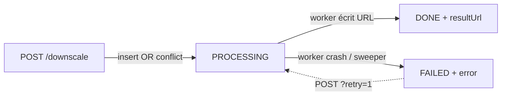

# Infra — Workers vidéo

Cinq Cloud Run Jobs gravitent autour de chaque vidéo. Trois sont
déclenchés automatiquement à l'upload (faststart / preview / hls), un
quatrième à la demande quand un user clique Download (downscale), et le
cinquième est un balayage périodique de sécurité (sweeper) piloté par
Cloud Scheduler.

| Job | Déclenché par | Quand | Taille |
|---|---|---|---|
| `faststart-worker[-staging]` | API (POST Version) | À chaque upload | 4 vCPU / 16 Gi |
| `hls-worker[-staging]` | API (POST Version) | À chaque upload | 4 vCPU / 16 Gi |
| `preview-worker[-staging]` | API (POST Version) | À chaque upload | 8 vCPU / 16 Gi |
| `downscale-worker[-staging]` | API (POST /downscale) | À la demande | 4 vCPU / 16 Gi |
| `downscale-sweeper[-staging]` | Cloud Scheduler | Toutes les 5 min | 1 vCPU / 512 Mi |

Tous partagent la même image que l'API ; le `command` / `args` du Job
définit l'entrypoint exécuté. Le déploiement de tous les Jobs est
décrit en YAML dans `cloudbuild{,-staging}.yaml` et s'auto-met à jour
à chaque push.

## Faststart worker

**But** : réécrit le MP4 source avec le moov atom au début. Sur les fichiers
créés par certains encodeurs (ffmpeg sans `-movflags +faststart`, certaines
caméras), le moov atom est en fin de fichier — le browser doit télécharger
**tout** le fichier avant de pouvoir commencer la lecture. Avec moov en
début, le browser peut streamer en progressive download.

### Commande ffmpeg

```bash
ffmpeg -y -i input.mp4 \
  -c copy -movflags +faststart \
  output_faststart.mp4
```

`-c copy` → pas de réencodage, on déplace juste l'index. Très rapide
(quelques secondes même sur 4K 1h).

### Sortie

`gs://toftal-clip-media/videos/<id>_faststart.mp4` — référencé dans
`Version.alternativeQualities.faststart`.

## Preview worker

**But** : générer un MP4 480p **ultrafast** pour permettre au front d'avoir
quelque chose à lire **immédiatement**, en attendant que le HLS soit prêt.

### Commande ffmpeg

```bash
# Détection audio
HAS_AUDIO=$(ffprobe -v error -select_streams a:0 \
  -show_entries stream=codec_type \
  -of csv=p=0 input.mp4)

if [ -n "$HAS_AUDIO" ]; then
  AUDIO_OPTS="-map a:0 -c:a aac -b:a 96k"
else
  AUDIO_OPTS=""
fi

ffmpeg -y -i input.mp4 \
  -map v:0 \
  -c:v libx264 -preset ultrafast -crf 28 \
  -vf "scale=854:-2:force_divisible_by=2" \
  -b:v 800k -maxrate 1000k -bufsize 1500k \
  $AUDIO_OPTS \
  -movflags +faststart \
  output_preview.mp4
```

!!! warning "force_divisible_by=2"
    libx264 plante si la hauteur ou la largeur n'est pas paire (ex. vertical
    1080x1920 scalé en 854:-2 donnerait 854x1518 → fail). Le filtre
    `force_divisible_by=2` arrondit.

!!! warning "Audio optionnel"
    Une vidéo silencieuse n'a pas de stream `a:0`. Sans le check `ffprobe`,
    `-map a:0 -c:a aac` plante avec "Stream map 'a:0' matches no streams".

### Sortie

`gs://toftal-clip-media/videos/<id>_preview.mp4` →
`Version.alternativeQualities.preview`.

## HLS worker

**But** : générer un master playlist + segments multi-qualité pour le
streaming adaptatif (hls.js sur les browsers non-Safari, natif sur Safari).

### Sortie

```
gs://toftal-clip-media/hls/<versionId>/
├── master.m3u8
├── 360p/
│   ├── playlist.m3u8
│   └── segment_000.ts ...
├── 480p/
├── 720p/
└── 1080p/
```

`Version.hlsUrl = https://media.<env>.toftalclip.io/hls/<versionId>/master.m3u8`

### Qualités générées

Le worker génère uniquement les qualités **inférieures ou égales** à la
résolution source. Pour une source 720p, on a 360p + 480p + 720p, pas de
1080p (upscale = qualité inférieure pour bande passante supérieure).

## Sizing — pourquoi 16 Gi / 8 vCPU ?

Cloud Run gen2 stocke `/tmp` en **RAM** (pas sur disque). Sur une vidéo 4K
d'1h :

- Source MP4 : ~3-5 GB
- Output HLS (toutes qualités) : ~2-4 GB
- Buffers ffmpeg : ~500 MB

Total : 6-10 GB. Avec 8 GB de RAM on tape l'OOM kill. 16 Gi laisse un confort
de sécurité.

8 vCPU : ffmpeg encode environ 2-3x plus vite à 8 vCPU qu'à 2. Le coût
marginal est faible (Cloud Run Jobs = facturation à la seconde) et ça améliore
fortement l'UX.

## Notification de fin

Chaque worker, à la fin du traitement :

1. `prisma.$disconnect()` (au cas où)
2. POST `/api/v1/internal/<faststart|preview|hls>-ready` avec :
   - Header `X-Internal-Secret: <INTERNAL_API_SECRET>`
   - Body `{ versionId, gcsUrl }`
3. L'API met à jour la `Version` et fan out les notifs WebSocket aux clients
   connectés

## Downscale worker

**But** : produire à la demande une variante MP4 d'une qualité plus
basse que la source (1080p → 720p, 4K → 1080p, …) quand un utilisateur
choisit cette qualité dans le bouton Download. Synchrone à l'origine,
maintenant async — la requête HTTP retourne 202 + `jobId` et le front
poll `/downscale/:quality/status`.

### Pourquoi async

Cloud Run a un timeout de requête HTTP. Sur une source 14 min,
ffmpeg-downscale prenait ~27 min en `preset medium`, donc la requête
mourrait toujours à 5-10 min selon la config. En sortant le travail
dans un Cloud Run Job dédié, il n'y a plus de limite côté requête —
seul le timeout du Job (60 min) s'applique.

### Dedup

Une table `version_downscale_jobs` avec `UNIQUE(version_id, quality)`
garantit qu'on ne lance jamais deux workers pour la même paire
`(version, quality)`. Si N utilisateurs cliquent simultanément
"Download 720p" sur la même vidéo, un seul Job tourne et tous reçoivent
la même URL à la fin.

### Cycle de vie de la row



### Commande ffmpeg

```bash
ffmpeg -hide_banner -loglevel error -nostdin \
  -i "$VIDEO_URL" \
  -vf "scale=W:H:force_original_aspect_ratio=decrease,pad=W:H:(ow-iw)/2:(oh-ih)/2" \
  -c:v libx264 -preset veryfast -b:v 2500k -maxrate 2500k -bufsize 5000k \
  -c:a aac -b:a 128k \
  -movflags +faststart \
  -threads 0 \
  /tmp/video_720p_<ts>.mp4 -y
```

`preset veryfast` au lieu de `medium` : passe de 0.5× à 3-4× realtime,
ce qui ramène le downscale d'une vidéo 14 min à ~4 min.

### Sortie

`gs://toftal-clip-media/videos/video_<quality>_<ts>.mp4` — URL miroir
dans `Version.alternativeQualities[<quality>]` ET dans
`VersionDownscaleJob.resultUrl` (transaction atomique).

### Endpoints API

| Verbe | Route auth | Route share |
|---|---|---|
| POST | `/api/v1/deliverables/:id/versions/:vid/downscale` | `/api/v1/deliverable-share/:token/version/:vid/downscale` |
| GET status | `/api/v1/deliverables/:id/versions/:vid/downscale/:quality/status` | `/api/v1/deliverable-share/:token/version/:vid/downscale/:quality/status` |

Codes retournés : `200` (DONE, URL servie), `202` (PROCESSING),
`409` (FAILED, retry possible via `?retry=1` sur le POST).

## Downscale sweeper (Cloud Scheduler)

**But** : recycler les rows `version_downscale_jobs` bloquées en
`PROCESSING` au-delà de 1 h. Un worker peut être SIGKILL'd par Cloud
Run (OOM, reschedule, panne réseau juste avant l'UPDATE final) — sans
intervention la row resterait PROCESSING pour toujours, et la
contrainte UNIQUE bloquerait toute nouvelle tentative sur la même
paire `(version, quality)`.

### Logique

```sql
UPDATE version_downscale_jobs
SET status = 'FAILED',
    error  = 'Worker did not finish in time (zombie — recycled by sweeper)',
    finished_at = NOW()
WHERE status = 'PROCESSING'
  AND started_at < NOW() - INTERVAL '1 hour';
```

Une seule requête, retour du nombre de rows recyclées. Coût quasi-nul.

### Cloud Scheduler

Le sweeper lui-même est un Cloud Run Job ; ce qui le déclenche est un
job Cloud Scheduler HTTP qui POST sur l'API admin Cloud Run :

```text
Job Scheduler:  downscale-sweeper[-staging]-cron
Schedule:       */5 * * * *   (toutes les 5 min)
Method:         POST
URI:            https://europe-west1-run.googleapis.com
                /apis/run.googleapis.com/v1/namespaces/toftal-clip-api
                /jobs/downscale-sweeper[-staging]:run
Auth:           OAuth via scheduler-invoker-sa
                (a roles/run.invoker sur le Job sweeper)
```

### IAM associée (one-shot par env)

Pas dans `cloudbuild*.yaml` — voir `cloudrun-jobs/README.md` §
"One-time IAM setup (per environment)".

## Tableau récapitulatif des entrypoints

| Job | Entrypoint (Docker `command` + `args`) |
|---|---|
| `faststart-worker[-staging]` | `node dist/workers/faststart.js` |
| `hls-worker[-staging]` | `node dist/workers/hls.js` |
| `preview-worker[-staging]` | `node dist/workers/preview.js` |
| `downscale-worker[-staging]` | `npm run downscale:run` → `ts-node scripts/downscale-version.ts` |
| `downscale-sweeper[-staging]` | `npm run downscale:sweep` → `ts-node scripts/sweep-downscale-zombies.ts` |
